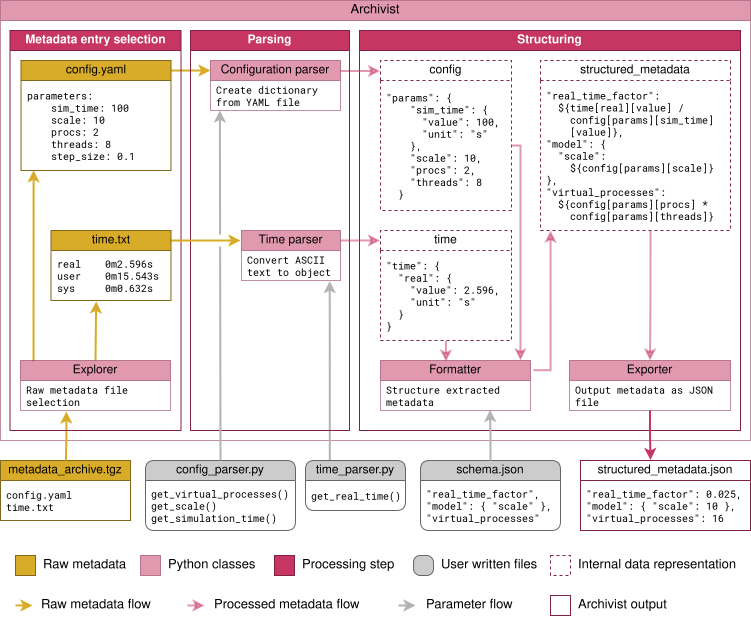

# Metadata Archivist



From the user perspective, the **Archivist** class is provided with all inputs associated with the pipeline. Internally, the **Explorer** (light red) class sorts the individual files to process from a collection of raw metadata files (yellow), and dispatches them to corresponding **Parsers**.
Then, each **Parser** (light red) employs user defined functions (gray) to extract specific information from the respective files.
After this, the **Formatter** (light red) collects the parsing results; if a schema (gray) is provided, the composite result can be structured following user design. The final processed metadata is output in a format of choice by the **Exporter** (light red).

Excerpt from [DOI]()

## Description
The Metadata Archivist is a simple framework to process multiple heterogenous input files and unify the parsed information into a singular structured output.
Users must define their own parsing procedures, then with a convenience class offered by our framework, orchestrate exploration the exploration of a given directory or archive, filtering of files to process, parse and optionally structure the target, lastly export the output to a selected format.

## Installation
Package is pip installable with (at the root of the repository):
```shell
pip install -e .
```

Currently there are no external dependencies, however if the [jsonschema](https://pypi.org/project/jsonschema/) package is present in the Python environment, then the parsing results can be automatically validated against a user defined schema.

TESTED WITH PYTHON v3.10.12

## Modules:
* Parser.py: abstract class to parse metadata from file. To be specialized by custom parser made by users.
* Explorer.py: class for retrieving files from compressed archives or directories. Filtering is done by comparing file names against input file patterns defined in Parsers.
* Formatter: class for handling Parsers. Coordinates parsing of files using Explorer output and user defined Parsers. If a user schema is provided, formats the metadata output according to the defined schema using a schema interpreter.
* Exporter.py: class to save formatted metadata to file. Currently only available export format is JSON.
* Archivist.py: class for orchestrating Explorer, Formatter, and Exporter classes.
* interpretation_rules.py: Module containing collection of rules as functions to interpreter user defined schema.
* formatting_rules.py: Module containing collection of rules as functions to format according to interpreted schema.
* export_rules.py: Module containing collection of rules as functions to export metadata according to user defined format.
* helper_classes.py: Module containing collection of convenience classes internally used.
* helper_functions.py: Module containing collection of convenience functions internally used.
* logger.py: internally used logging class extension.

## Examples:
We have provided some example implementation files in the [examples](./examples/) directory.
Some have additional requirements like [PyYAML](https://pypi.org/project/PyYAML/) or [f90nml](https://pypi.org/project/f90nml/).
Additionally a jupyter example can be found at [schema_tutorial](./examples/schema_example4/schema_tutorial.ipynb).

To run Python examples:
```shell
python main.py
```

## How to cite:
[Villamar et al. 2024, Metadata practices for simulation workflows, arxiv]()

## How to contribute:
Check our [CONTRIBUTING](./CONTRIBUTING.md) guidelines.

## Schema Interpreter Notes
To be able to parse abstract schema and generate correctly structured metadata files,
an interpretable data structure is needed to convert implicit schema definitions to explicit functional rules.

### Terms
* Exploration target:
  * Directory or archive containing a tree structure of sub-directories (branches) and raw metadata files (leafs).
  * The tree structure can be flat i.e. only contain leafs or have an arbitrary number of branches each containing at least one leaf.
* Parser/parsing results:
 * A Parser is the entity reading from raw metadata files and parsing the information as defined by the user.
 * The parsing results are the output of the Parser on a given raw metadata file.
 * Each Parser produces results in its own structure as defined by the user.
* Formatter/formatting result:
 * The Formatter is the entity gathering all the parsing results from all the defined Parsers and merging it together in an unified metadata file.
 * The formatting result is the output metadata file.
 * The Formatter produces results on either a default structure following the metadata archive tree or a JSON schema can be provided to specify the structure and contents.
* JSON schema:
  * Through the properties (and only the properties) of the schema the user can define the structure of the unified metadata file.
  * On a broad perspective, the properties (tree) of the schema are composed of either acyclic nested structure (branches) or simple values (leafs).
  * Parsers and their results can be referenced at bottom level structures.

### Basic premise
The structure of the unified metadata file can be separated by structure stemming from the formatting results and structure stemming from the parsing results.
When using a schema, the structure of the formatting results are solely dictated by the schema.
Hence, when exploring the schema to generate the interpretable data structure one can consider the branching in the schema structure as branching of the metadata structure and the parsing structure as a terminal value.

### Technical assumptions
- We only recognize two data types in the schema, dictionaries and strings i.e. the schema is composed of key[str] -> value[dict|str],
  - Any other type is considered as an non-implemented feature.
  - From this we assume that we either explore a dictionary as a branch or a string as a leaf.
- Currently the only functional leafs are either references to parsers definitions, !varname for patternProperties, and !calculate directives that combine both previous functional leafs,
  - All other leafs are considered as JSON Schema specific values and ignored.
  - It is possible to reference internal parser properties however this can only be done inside the parser definition.
  - References are defined through unix-style paths with the definition section at its root, due to "/" being used as path separator, the character cannot be used in parser names.
  - !varname instructions are considered as additional contextual information.
  - !varname instructions can only be found in a patterProperty context.
- Exploring starts from the properties at the root of the schema and a recursion is applied over every dictionary found inside.
- A Parser must always be introduced inside a named dictionary containing an optional !parsing instruction and a mandatory reference to its definition (structure name -> {(!parsing: dict)?, $ref: $def})
  - Only one reference to a definition is accepted per named dictionary. (TODO: expand on the future?)
  - !parsing instructions point to dictionaries but this are not considered branches of the metadata structure, instead are considered as additional contextual information.
  - !parsing instructions must always precede the reference.

## Contact:
Jose Villamar, Institute for Advanced Simulation (IAS-6), Jülich Research Centre, Jülich, Germany, j.villamar@fz-juelich.de
Matthias Kelbling, Department of Computational Hydrosystems, Helmholtz-Centre for Environmental Research, Leipzig, Germany, matthias.kelbling@ufz.de

## License:
GPL v3.0 [LICENSE](./LICENSE)
